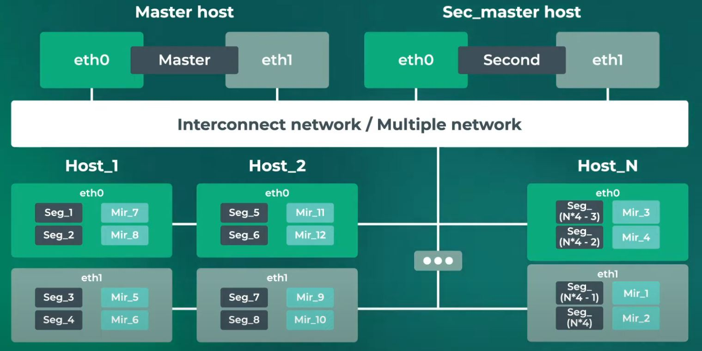

# Homework 1
## 1. DragonFlyDB

DragonFlyDB -- современная in-memory БД, совместимая с Redis. In-memory означит, что данные хранятся в оперативной памяти, а диск используется для бэкапа.

В основу DragonFly DB заложена "Высокая доступность" (HA) -- это подход к проектированию системы, обеспечивающий высокий уровень производительности и безотказности работы. В Dragonfly высокой доступности можно достичь с помощью репликации и создания реплик для чтения, которые можно использовать в качестве механизма обхода отказа в случае выхода из строя основного экземпляра.

Dragonfly DB поддерживает модель первичной/вторичной репликации, аналогичную репликации Redis. При использовании репликации Dragonfly создает точные копии первичного экземпляра. При правильной настройке вторичные экземпляры подключаются к первичному при любом разрыве соединения и всегда стремятся оставаться точной копией первичного. Также Dragonfly DB режим кластера схожий, с Redis CLuster, а именно, деление узлов на master/slave. Если master - узел выходит из строя система автоматически переводит соответствующий slave-узел на роль нового master, что обеспечивает выполнение условия A CAP-теоремы.

Как уже было упомянуто, DragonFly DB использует master/slave деление узлов, т.е. все запросы идут через master-узел, что позволяет достичь консистентности данных, т.е. выполняется уловие P CAP-теоремы.

#### Таким образом DragonFly DB удовлетворяет CA правилу.

## 2. ScyllaDb

ScyllaDB -- это распределенная, колоночная NoSQL база данных, предназначенная для обработки больших объемов данных с высокой производительностью и низкой задержкой. Она является open-source продуктом и совместима с популярной Apache Cassandra -- поддерживает CQL -- язык запросов к Cassandra -- и имеет схожий принцип работы. В отличие от Apache Cassandra, ScyllaDB написана на C++ с использованием фреймворка Seastar, что обеспечивает высокую асинхронность операций и позволяет избежать задержек сборки мусора (GC), распространенных в Java.

ScyllaDB -- это кластер, совокупность взаимосвязанных узлов, организованных в архитектуру виртуального кольца, по которому распределяются данные. Все узлы считаются равноценными. Без master-узла кластер не имеет единой точки отказа. Для надежности кластер может хранить несколько копий одних и тех же данных на разных узлах (количество хранимых копий называется фактором реплицирования).

Как уже было сказано, ScyllaDB не имеет master/slave деления узлов, вследствие чего каждая нода может принимать и обрабывать запросы пользователей. Всвязи с этим отсутствие связи между нодами не влияет на работу БД, откуда следует, что выполняется пункт P теоремы CAP.

Если же какая-либо нода вышла из строя, аналогично прошлому случаю, запросы пользователя будут адресовыватсья другой, рабочей ноде, содержащей реплицированную информацию, откуда получаем, что выполнен пункт A CAP-теоремы.

По умолчанию ScyllaDB (как и Cassandra) удовлетворяют AP условию, однако, существуют механизмы, чтобы попытаться достичь выполнения всех условий, а именно, принцип immediate consistency, вкратце подбор CL (consistency level) для чтения и записи таким образом, чтобы number of reads + number of writes > RF (replication factor), по умолчанию Read/Write CL = QUORUM.

Таким образом ScyllaDB удовлетворяет условию AP (с соответствующими оговорками).

## 3. ArenadataDB

Arenadata DB (ADB) — аналитическая, распределённая СУБД, построенная на MPP-системе с открытым исходным кодом Greenplum.

### Устройство.

Устройство Arenadata DB указано на рисунке.

3.1 Master сервер -- на нем находится master сегмент -- обычный instance PostgreSQL (немного видоизмененнный, однако пользователи видят как обычный PostgreSQL). Этот сервер (и master сегмент) не хранят данные и не занимаются обработкой, они лишь принимают запросы, парсят их и раскидывают запросы далее на воркеры. Есть также вторичный master сервер, на котором крутится такой же master сегмент и из основного master'а во вторичный настроена репликация. В случае отказа master host'а, вся нагрузка переходит на вторичный master host. 

3.2 Далее идет сетевой слой -- соединяет сервера master'а c серверами-сегментами

3.3 Сервера-сегменты -- мощные сервера, которые хранят и обрабатывают данные. На этих серверах находятся логические сегменты (такие же инстансы PostgreSQL, доступ к которым имеет только master). У каждого такого сегмента есть (может не быть) зеркало (только одно), хранящееся на другом сервере.

Такое устройство позволяет при выходе одного из серверов сегментов вся нагрузка с его сегментов логических перераспределяется на соответствующие зеркала. То есть при отказе любого компонента (любого из мастеров, сегмент серверов, любого компонента сетевого слоя) не будет утеряна доступность и можно будет продолжать работу с БД. Таким образом выполняется часть A CAP-теоремы.

Так как все взаимодействие происходит через master-сегменты, то на сегмент-серверах не могут различаться данные между любым логическим сегментом и соответствующим ему зеркалом, что дает C часть теоремы CAP.

#### Таким образом Arenadata DB удовлетворяет CA правилу.