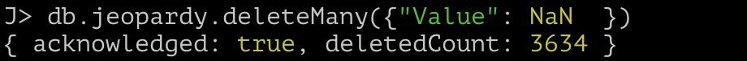
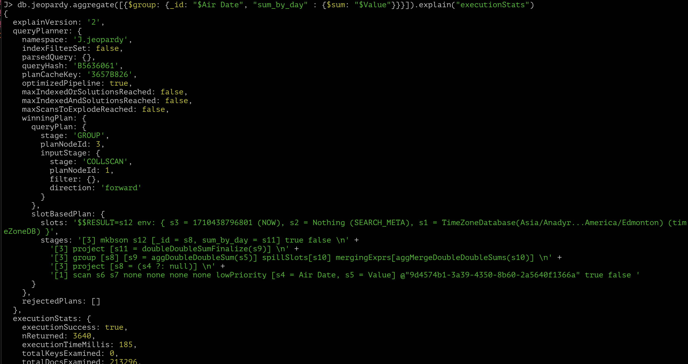

# Homework 1

### 1. Устанавливаем Docker и открываем его.


### 2. Устанавливаем MongoDB и запускаем контейнер.

Для этого используем команды (https://phoenixnap.com/kb/docker-mongodb)

a) Устанавливаем MongoDB с официального Docker image с помощью команды
 
 ```sh
 sudo docker pull mongo
 ```

б) Создаем папку /mongodata командой

```sh
sudo mkdir -p /mongodata
```

в) Запускаем Docker-контейнер с MongoDB командой 

```sh
sudo docker run -it -v mongodata:/data/db --name mongodb -d mongo
```

Видим, что mongodb появляется в списке актиных контейнеров (скрин выше).

### 3. Загрузка данных

a) Переходим на сайт https://habr.com/ru/companies/edison/articles/480408/ и скачиваем датасет "Jeopardy Dataset"

b) Заходим в Shell контейнера с помощью команды

```sh
sudo docker exec -it mongodb bash
```

оказываемся в корне контейнера
```sh
root@531e2c5ccc14:/
```

и с помощью команды 

```sh
cd home
```

переходим в директорию

```sh
root@531e2c5ccc14:/home
```

в которой создаем  папку, в которой будут храниться датасеты

```sh
root@531e2c5ccc14:/home/data
```

c) Выходим из Shell'а контейнера и переходим в папку, где лежит скачанный датасет и оттуда с помощью команды

```sh
docker cp JEOPARDY_CSV.csv 531e2c5ccc148db571697c1e8aef7000ba80635f7eee60327dba900e5110e372:/home/data/JEOPARDY_CSV.csv
```

где 531e2c5cc... - название моего контейнера, а :home/data/JEOPARDY_CSV.csv - пусть к датасету в контейнере.


d) Далее переходим в Shell контейнера и используем команду

```sh
mongosh
```

чтобы перейти в MongoDB Shell. Создаем коллекцию с названием ```jeopardy```, в которую потом загрузим датасет, с помошью команды

```SQL
db.createCollection("jeopardy")
```

e) Выходим с помощью команды

```SQL
exit
```

в Shell контейнера и переходим в папку ```root@531e2c5ccc14:/home/data``` где лежит наш датасет, после чего с помощью команды

```sh
mongoimport -d J -c jeopardy --type csv --file JEOPARDY_CSV.csv  --headerline
```

импортируем наш csv-датасет в БД. ```-d J``` - название базы, куда происхоид импорт, ```-c jeopardy``` - название схемы, ```--type csv``` - указание, что используемый тип - scv, ```--file JEOPARDY_CSV.csv``` - указание, какой файл испортируем, ```--headerline``` - указание, что ключи в документе надо брать по заголовкам csv-файла.

f) После чего перейдя в ```J``` можем убедиться, что записи в ней действительно появились

```SQL
use MyNewDb
db.jeopardy.find().limit(5)
```
 

### 4. CRUD-запросы.

a) UPDATE - запрос. В дальнейшем мы будем считать сумму по полю ```Value```, поэтому необходимо привести его к типу ```Int```. Для этого необходимо отбросить первый знак $\$$ и далее преобразовать полученную подстроку к числу. Осуществить такой запрос можно с помощью следующей команды.

```SQL
db.jeopardy.find().forEach(
    function (ch) {
        var substring = ch.Value.substring(1);
        db.jeopardy.update(
            { "_id": ch._id },
            { "$set": { "Value": parseInt(substring) } }
        );
    }
);
```

в этом запросе мы для каждого документа берем подстроку поля ```Value```, начиная с 1-го индекса и присваиваем его переменной ```substring```. В этом же документе (в документе с таким же ```_id```) мы с помощью команды ```$set``` присваиваем полю ```Value``` преобразованную в ```Int``` подстроку ```substring``` (функция ```parseInt```). После чего можем убедиться в том, что все сработало корректно, вывев первые элементы коллекции.


б) DELETE - запрос. Для того, чтобы вывести сумму ```Value```, сагрегированную по дням нам мешают ```None``` в некоторых документах, которые при UPDATE - запросе превратились в ```NaN```. Для этого удалим элементы, где поле ```Value``` является NAN'ом. В этом нам поможет команда

```sh
db.jeopardy.deleteMany({"Value": NaN  })
```

После чего нам в консоль приходит ответ о том, сколько элементов удалилось.



в) SELECT - запрос. Теперь просуммируем поле ```Value``` и сагрегируем по датам (поле ```Air Date```). Сделать это можно с помощью запроса

```SQL
db.jeopardy.aggregate(
    [
        {
            $group: {
                _id: "$Air Date",
                "sum_by_day" : {$sum: "$Value"}
            }
        }
    ]
)
```

После которого получаем желаемый результат


д) CREATE - запрос

### 5. Создание курсора. Сравнение времени работы.

Сначала выполним указанный выше SELECT-запрос без создания индекса и замерим время: получаем 185 миллисек



Теперь создадим индекс на поле Air Date и снова выполним замеры

```SQL
db.jeopardy.createIndex({"Air Date": 1})
```


Получаем 100 миллисек


Это доказывает то, что добавление индекса ускоряет операции, использующие поле, по которому добавлен индекс.
